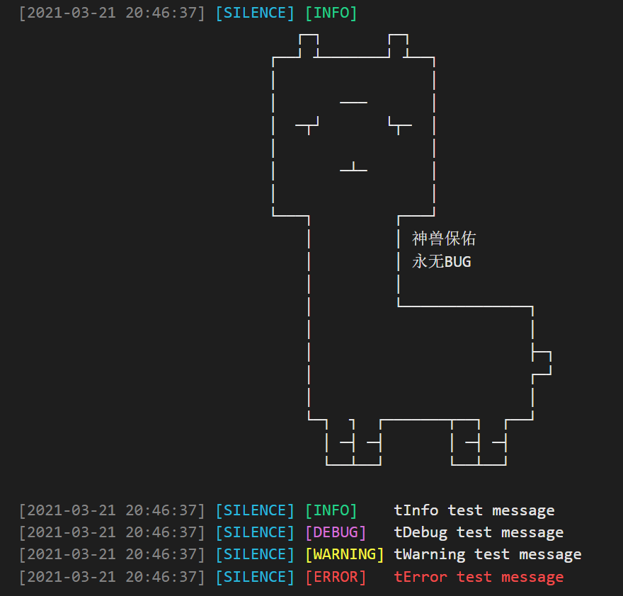

# t_logger

A simple logger tool

## Getting Started

```dart
TLogger.init(tag: 'SILENCE');
tInfo('tInfo test message');
tDebug('tDebug test message');
tWarning('tWarning test message');
tError('tError test message');
```

## Preview



